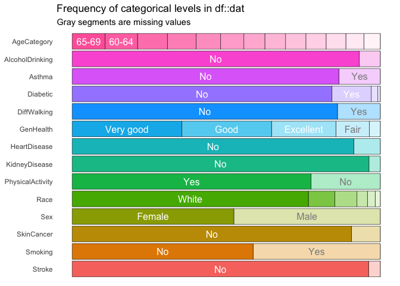
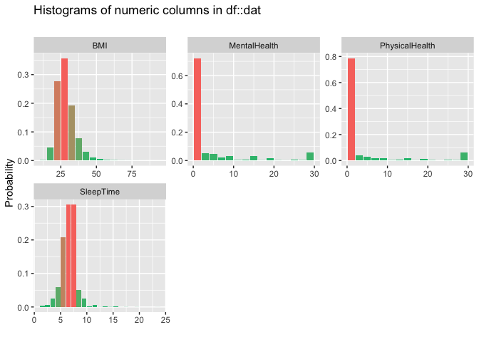
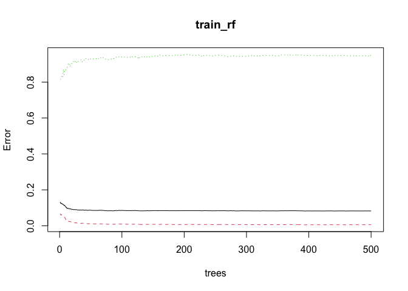

webPage
================
Ramona Wu
2022-12-16

# Introduction

Heart disease is one of the leading causes of death for people in the
US. About half of all Americans (47%) have at least 1 of 3 key risk
factors for heart disease: high blood pressure, high cholesterol, and
smoking. In this project, we are interested in predicting whether a
person can develop heart disease based on the known risk factors. The
data set we used (originally coming from the CDC), Personal Key
indicators of Heart Disease, is derived from the Behavioral Risk Factor
Surveillance System (BRFSS), which conducts annual telephone surveys to
gather data on the health status of US residents. It consisted of
401,958 rows and 279 columns originally, but for the purpose of
predicting heart disease, only around 18 variables were left, which are
believed to be the most relevant factors for the development of heart
disease. The goal of this project is to fit the best possible machine
learning model to the data set to predict whether or not a respondent
has heart disease based on the given variables.

In the Appendix there is a preview of the data set we used. It has 18
variables in total, including 17 predictors and 1 outcome variable. The
predictors are BMI, smoking, alcohol drinking, stroke, physical health,
mental health, difficulty walking, sex, age, race, diabetes, physical
activity, health condition, sleep time, asthma, kidney disease, and skin
cancer; and the outcome variable is heart disease. There are 2 graphs
showing the distributions of the categorical and continuous variables.
The respondents are more likely to have the following characteristics:
no alcohol drinking, no history of asthma, no history of diabetes, no
difficulty walking, no history of kidney disease, be physical active, be
white, no history of skin cancer, no history of stroke, low mental
health score, low physical health score, 7-8 hour sleep time, and BMI
between 25-30 kg/m^2.

In this project, we used the logistic regression, kNN, and the random
forest methods to predict the outcome of developing heart disease. We
used logistic regression as the first model, because the outcome
variable is binary, and the log odds can be an appropriate estimate. kNN
was the second model used. It is similar to bin smoothing, and it is
easier to adapt to multiple dimensions. In real life, doctors determine
a person’s risk for developing heart diseases by asking questions, which
is very much like a decision tree. Decision tree operates by predicting
an outcome variable Y by partitioning the predictors.The random forest
algorithm is a very popular machine learning approach that addresses the
shortcoming of decision tree by averaging multiple decision trees,
resulting in an improvement in prediction performance and reduction in
instability. Random forest was the third algorithm used in this project.

# Results

## Logistic regression

We partitioned the data set into train set and test set, where the train
set was 90% and the test set was 10% of the data set. The fitted model
showed that almost all the predictors (except for “AgeCategory25-29”,
“RaceOther”, “RaceWhite”, “DiabeticYes (during pregnancy)”, and
“PhysicalActivityYes”) have a p-value of less than 0.05, indicating that
these covariates are important predictors of the heart disease outcome.

A regression coefficient describes the size and direction of the
relationship between a predictor and the response variable. From the
result table, we can see that higher BMI, smoking, history of stroke,
bad physical health, bad mental health, difficulty walking, being a
male, old age, history of diabetes, physical inactivity, bad health
condition, history of asthma, history of kidney disease and history of
skin cancer are associated with a higher possibility of developing heart
disease. On the other hand, alcohol drinking (moderate) and longer
sleeping time are associated with a lower risk of developing heart
disease. If we look at categorical race, being Asian is the least likely
to develop the outcome. More specifically, the risk of heart disease in
descending order is Other, White, Hispanic, Black, Asian.

We then used the test set and the confusion matrix to determine how
accurate our model was. Even though the model has a high overall
accuracy of 0.916, the sensitivity is relatively low (sensitivity =
0.106), and this is mainly because the prevalence of heart disease is
low (p = 0.0855). The logistic regression model is much better than
guessing, but other algorithms are probably better in this situation.

## kNN

Similarly, we partitioned the data into training set and test set (9:1),
and we fitted the kNN model based on the training set. We tried k
(number of nearest neighbors) from 1- 101, and fitted a kNN model with
the best tune.

This kNN model improved the accuracy over the logistic regression, and
the overall accuracy is 93.2%. However, from the confusion matrix, we
can see that there is no prediction of “Outcome = 1”, indicating a very
low sensitivity. Even though the kNN model has a higher accuracy, it
does not necessarily mean that it is a better model.

## Random forest

For a classification problem, Breiman (2001) suggests mtry = p^0.5,
where p is the number of descriptive features. In our case, p = 17^2
(4.12). Therefore, we experimented with mtry = 3, 4, and 5. The
optimized model used a mtry value of 4.

We also used the plot function to check whether we had run enough trees.
ntree = 500 seemed to be a good choice, since the error did not decrease
any further after around 200 tress.

The overall prediction accuracy is 92.8%, which is higher than the
logistic regression model and the kNN model. However, similarly, the
sensitivity of this model is still low due to the low prevalance of
incidence heart disease.

# Conclusion

In this project, we fitted three different models to predict the outcome
of developing heart disease. All three models have a high overall
prediction accuracy (\>90%), but the sensitivity is low. This might be
due to the relatively low prevalence of the outcome. Out of the three
models, the random forest is the most accurate, and the most similar to
a doctor’s diagnosis procedure, and thus is the most appropriate model.
The logistic regression model is also very informative, since the
magnitude of the coefficient implies the effect of the predictor, and
the direction of the coefficient (positive or negative) implies whether
the predictors are protective or detrimental.

The analysis is successful. The overall prediction is high, and even
though the sensitivity is not ideal, there is not much we can do to
improve the sensitivity. If we had more time, we would fine tune the kNN
and random forest models using a larger size of training data. If we
could train these two models using as large a sample size as the
logistic regression model, they might out compete the logistic model
more. We can also do an ensemble by combining the results of different
algorithm, for example, taking the average of the kNN and the random
forest model to further improve the accuracy.

# References

Breiman, L. (2001), Random Forests, Machine Learning 45(1), 5-32.

Fryar CD, Chen T-C, Li X. Prevalence of uncontrolled risk factors for
cardiovascular disease: United States, 1999–2010 pdf icon\[PDF-494K\].
NCHS data brief, no. 103. Hyattsville, MD: National Center for Health
Statistics; 2012.

Personal Key Indicators of Heart Disease
<https://www.kaggle.com/datasets/kamilpytlak/personal-key-indicators-of-heart-disease>

# Appendix

``` r
library(tidyverse)
```

    ## ── Attaching packages ─────────────────────────────────────── tidyverse 1.3.2 ──
    ## ✔ ggplot2 3.3.6     ✔ purrr   0.3.4
    ## ✔ tibble  3.1.8     ✔ dplyr   1.0.9
    ## ✔ tidyr   1.2.0     ✔ stringr 1.4.1
    ## ✔ readr   2.1.2     ✔ forcats 0.5.2
    ## ── Conflicts ────────────────────────────────────────── tidyverse_conflicts() ──
    ## ✖ dplyr::filter() masks stats::filter()
    ## ✖ dplyr::lag()    masks stats::lag()

``` r
library(dslabs)
library(randomForest)
```

    ## randomForest 4.7-1.1
    ## Type rfNews() to see new features/changes/bug fixes.
    ## 
    ## Attaching package: 'randomForest'
    ## 
    ## The following object is masked from 'package:dplyr':
    ## 
    ##     combine
    ## 
    ## The following object is masked from 'package:ggplot2':
    ## 
    ##     margin

``` r
library(caret)
```

    ## Loading required package: lattice
    ## 
    ## Attaching package: 'caret'
    ## 
    ## The following object is masked from 'package:purrr':
    ## 
    ##     lift

``` r
library(inspectdf)
setwd("~/Desktop/Folder/HSPH/Fall 2022/BST260/FinalProject")
dat <- read.csv("heart_2020_cleaned.csv")
head(dat)
```

    ##   HeartDisease   BMI Smoking AlcoholDrinking Stroke PhysicalHealth MentalHealth
    ## 1           No 16.60     Yes              No     No              3           30
    ## 2           No 20.34      No              No    Yes              0            0
    ## 3           No 26.58     Yes              No     No             20           30
    ## 4           No 24.21      No              No     No              0            0
    ## 5           No 23.71      No              No     No             28            0
    ## 6          Yes 28.87     Yes              No     No              6            0
    ##   DiffWalking    Sex AgeCategory  Race Diabetic PhysicalActivity GenHealth
    ## 1          No Female       55-59 White      Yes              Yes Very good
    ## 2          No Female 80 or older White       No              Yes Very good
    ## 3          No   Male       65-69 White      Yes              Yes      Fair
    ## 4          No Female       75-79 White       No               No      Good
    ## 5         Yes Female       40-44 White       No              Yes Very good
    ## 6         Yes Female       75-79 Black       No               No      Fair
    ##   SleepTime Asthma KidneyDisease SkinCancer
    ## 1         5    Yes            No        Yes
    ## 2         7     No            No         No
    ## 3         8    Yes            No         No
    ## 4         6     No            No        Yes
    ## 5         8     No            No         No
    ## 6        12     No            No         No

``` r
dat |> inspect_cat() |> show_plot()
```

<!-- -->

``` r
dat |> inspect_num() |> show_plot()
```

<!-- -->

``` r
set.seed(1997)

# generate data set for logistic regression
dat_glm <- dat |> mutate(Outcome = as.numeric(HeartDisease == "Yes")) 
dat_glm <- subset(dat_glm, select = -c(HeartDisease))

# generate training set and test set
y <- dat_glm$Outcome
test_index <- createDataPartition(y, times = 1, p = 0.1, list = FALSE)
dat_glm_train <- dat_glm |> slice(-test_index)
dat_glm_test <- dat_glm |> slice(test_index)

# logistic regression
glm_fit <- glm(Outcome~., family=binomial(link="logit"), data = dat_glm_train)
summary(glm_fit)
```

    ## 
    ## Call:
    ## glm(formula = Outcome ~ ., family = binomial(link = "logit"), 
    ##     data = dat_glm_train)
    ## 
    ## Deviance Residuals: 
    ##     Min       1Q   Median       3Q      Max  
    ## -2.1230  -0.4114  -0.2441  -0.1291   3.6130  
    ## 
    ## Coefficients:
    ##                                   Estimate Std. Error z value Pr(>|z|)    
    ## (Intercept)                     -6.2816006  0.1209038 -51.955  < 2e-16 ***
    ## BMI                              0.0081786  0.0012033   6.797 1.07e-11 ***
    ## SmokingYes                       0.3597059  0.0151551  23.735  < 2e-16 ***
    ## AlcoholDrinkingYes              -0.2554880  0.0355042  -7.196 6.20e-13 ***
    ## StrokeYes                        1.0395153  0.0238840  43.524  < 2e-16 ***
    ## PhysicalHealth                   0.0033334  0.0009091   3.667 0.000246 ***
    ## MentalHealth                     0.0042695  0.0009309   4.586 4.51e-06 ***
    ## DiffWalkingYes                   0.2147057  0.0191276  11.225  < 2e-16 ***
    ## SexMale                          0.7042216  0.0153538  45.866  < 2e-16 ***
    ## AgeCategory25-29                 0.1436658  0.1302896   1.103 0.270172    
    ## AgeCategory30-34                 0.4345133  0.1181143   3.679 0.000234 ***
    ## AgeCategory35-39                 0.6180409  0.1118307   5.527 3.27e-08 ***
    ## AgeCategory40-44                 0.9825563  0.1056105   9.304  < 2e-16 ***
    ## AgeCategory45-49                 1.3103283  0.1016919  12.885  < 2e-16 ***
    ## AgeCategory50-54                 1.7329933  0.0981560  17.656  < 2e-16 ***
    ## AgeCategory55-59                 1.9513806  0.0966882  20.182  < 2e-16 ***
    ## AgeCategory60-64                 2.2284156  0.0957544  23.272  < 2e-16 ***
    ## AgeCategory65-69                 2.4697890  0.0954688  25.870  < 2e-16 ***
    ## AgeCategory70-74                 2.7449148  0.0954086  28.770  < 2e-16 ***
    ## AgeCategory75-79                 2.9490959  0.0959810  30.726  < 2e-16 ***
    ## AgeCategory80 or older           3.1941612  0.0957222  33.369  < 2e-16 ***
    ## RaceAsian                       -0.5084640  0.0878641  -5.787 7.17e-09 ***
    ## RaceBlack                       -0.3403530  0.0607291  -5.604 2.09e-08 ***
    ## RaceHispanic                    -0.2443084  0.0618296  -3.951 7.77e-05 ***
    ## RaceOther                       -0.0664242  0.0673697  -0.986 0.324150    
    ## RaceWhite                       -0.0752536  0.0542140  -1.388 0.165112    
    ## DiabeticNo, borderline diabetes  0.1468365  0.0439527   3.341 0.000835 ***
    ## DiabeticYes                      0.4854778  0.0176133  27.563  < 2e-16 ***
    ## DiabeticYes (during pregnancy)   0.1550451  0.1099100   1.411 0.158346    
    ## PhysicalActivityYes              0.0145583  0.0169374   0.860 0.390044    
    ## GenHealthFair                    1.5257683  0.0347061  43.963  < 2e-16 ***
    ## GenHealthGood                    1.0583739  0.0312354  33.884  < 2e-16 ***
    ## GenHealthPoor                    1.8888169  0.0432330  43.689  < 2e-16 ***
    ## GenHealthVery good               0.4763188  0.0320772  14.849  < 2e-16 ***
    ## SleepTime                       -0.0253579  0.0045773  -5.540 3.03e-08 ***
    ## AsthmaYes                        0.2674943  0.0203098  13.171  < 2e-16 ***
    ## KidneyDiseaseYes                 0.5564146  0.0257611  21.599  < 2e-16 ***
    ## SkinCancerYes                    0.1229816  0.0205514   5.984 2.18e-09 ***
    ## ---
    ## Signif. codes:  0 '***' 0.001 '**' 0.01 '*' 0.05 '.' 0.1 ' ' 1
    ## 
    ## (Dispersion parameter for binomial family taken to be 1)
    ## 
    ##     Null deviance: 168046  on 287814  degrees of freedom
    ## Residual deviance: 130607  on 287777  degrees of freedom
    ## AIC: 130683
    ## 
    ## Number of Fisher Scoring iterations: 7

``` r
# prediction using the test set
prediction1 <- predict(glm_fit, dat_glm_test, type = "response")
prediction2 <- ifelse(prediction1 > 0.5, 1, 0) |> factor()
cm <- confusionMatrix(prediction2, as.factor(dat_glm_test$Outcome))
cm$table
```

    ##           Reference
    ## Prediction     0     1
    ##          0 28992  2480
    ##          1   215   293

``` r
confusionMatrix(prediction2, as.factor(dat_glm_test$Outcome))$overall[["Accuracy"]] 
```

    ## [1] 0.9157286

``` r
# generate training set and test set for kNN
set.seed(1997)
dat_kNN <- dat |> mutate(Outcome = as.numeric(HeartDisease == "Yes")) 
dat_kNN <- subset(dat_kNN, select = -c(HeartDisease))
dat_kNN_train <- sample_n(dat_kNN, 2000)
dat_kNN_test <- sample_n(dat_kNN, 500)

# fit a kNN model and find the best tune
train_kNN <- train(as.factor(Outcome) ~ ., method = "knn", 
                   dat_kNN_train, 
                   tuneGrid = data.frame(k = seq(1, 101, 5))) 

train_kNN
```

    ## k-Nearest Neighbors 
    ## 
    ## 2000 samples
    ##   17 predictor
    ##    2 classes: '0', '1' 
    ## 
    ## No pre-processing
    ## Resampling: Bootstrapped (25 reps) 
    ## Summary of sample sizes: 2000, 2000, 2000, 2000, 2000, 2000, ... 
    ## Resampling results across tuning parameters:
    ## 
    ##   k    Accuracy   Kappa      
    ##     1  0.8592780  0.094296418
    ##     6  0.8864647  0.054051504
    ##    11  0.8998383  0.035036377
    ##    16  0.9029721  0.014943258
    ##    21  0.9047445  0.010657415
    ##    26  0.9057128  0.011285736
    ##    31  0.9059910  0.006789873
    ##    36  0.9059388  0.002288080
    ##    41  0.9062087  0.002084556
    ##    46  0.9062090  0.000000000
    ##    51  0.9062090  0.000000000
    ##    56  0.9062090  0.000000000
    ##    61  0.9062090  0.000000000
    ##    66  0.9062090  0.000000000
    ##    71  0.9062090  0.000000000
    ##    76  0.9062090  0.000000000
    ##    81  0.9062090  0.000000000
    ##    86  0.9062090  0.000000000
    ##    91  0.9062090  0.000000000
    ##    96  0.9062090  0.000000000
    ##   101  0.9062090  0.000000000
    ## 
    ## Accuracy was used to select the optimal model using the largest value.
    ## The final value used for the model was k = 101.

``` r
# fit the kNN model to the test data
prediction_kNN <- predict (train_kNN, newdata = dat_kNN_test)
cm2 <- confusionMatrix(prediction_kNN, as.factor(dat_kNN_test$Outcome))
cm2$table
```

    ##           Reference
    ## Prediction   0   1
    ##          0 457  43
    ##          1   0   0

``` r
confusionMatrix(prediction_kNN, as.factor(dat_kNN_test$Outcome))$overall[["Accuracy"]]
```

    ## [1] 0.914

``` r
# generate training set and test set for random forest
set.seed(1997)

dat_rf <- dat |> mutate(Outcome = as.numeric(HeartDisease == "Yes")) 
dat_rf<- subset(dat_rf, select = -c(HeartDisease))

dat_rf_train <- sample_n(dat_rf, 5000)
dat_rf_test <- sample_n(dat_rf, 500)
```

``` r
# fit the random forest model
grid <- data.frame(mtry = c(3, 4, 5))
train_rf <- randomForest(as.factor(Outcome)~., data = dat_rf_train, tuneGrid = grid) 

train_rf
```

    ## 
    ## Call:
    ##  randomForest(formula = as.factor(Outcome) ~ ., data = dat_rf_train,      tuneGrid = grid) 
    ##                Type of random forest: classification
    ##                      Number of trees: 500
    ## No. of variables tried at each split: 4
    ## 
    ##         OOB estimate of  error rate: 8.26%
    ## Confusion matrix:
    ##      0  1 class.error
    ## 0 4565 27 0.005879791
    ## 1  386 22 0.946078431

``` r
# To check that we ran enough trees we can use the plot function
plot(train_rf)
```

<!-- -->

``` r
prediction_rf <- predict(train_rf, newdata = dat_rf_test)
cm3 <- confusionMatrix(prediction_rf, as.factor(dat_rf_test$Outcome))
cm3$table
```

    ##           Reference
    ## Prediction   0   1
    ##          0 459  34
    ##          1   2   5

``` r
confusionMatrix(prediction_rf, as.factor(dat_rf_test$Outcome))$overall[["Accuracy"]]
```

    ## [1] 0.928
